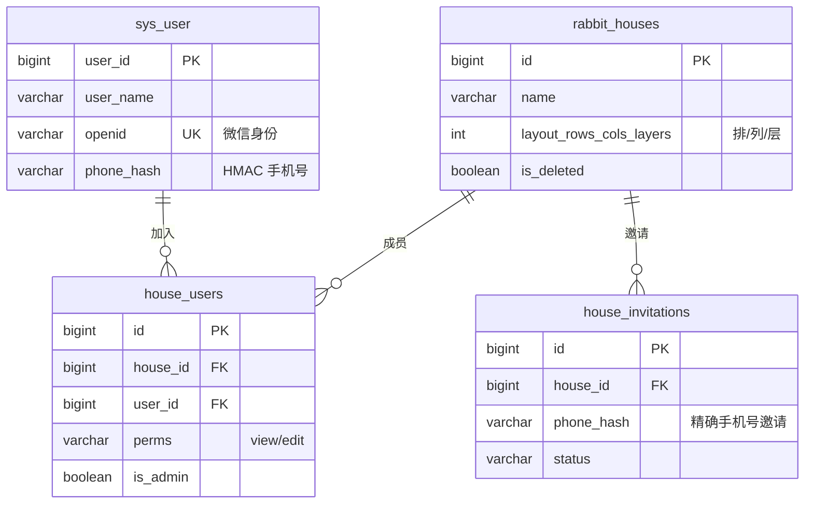
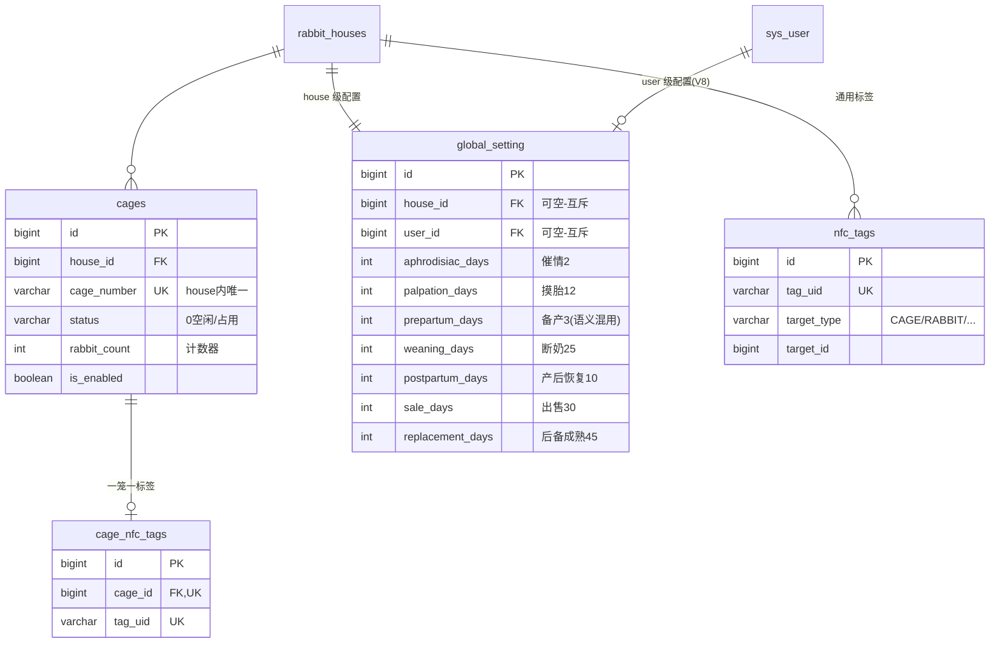
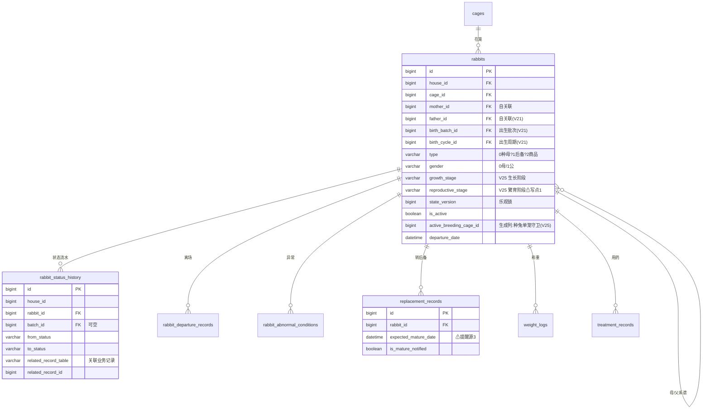
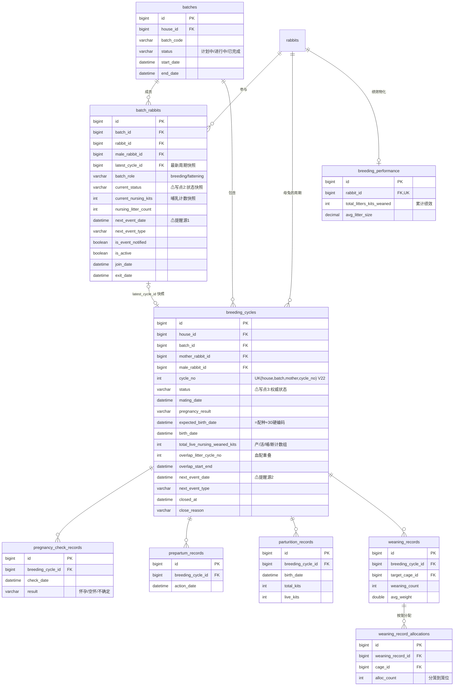
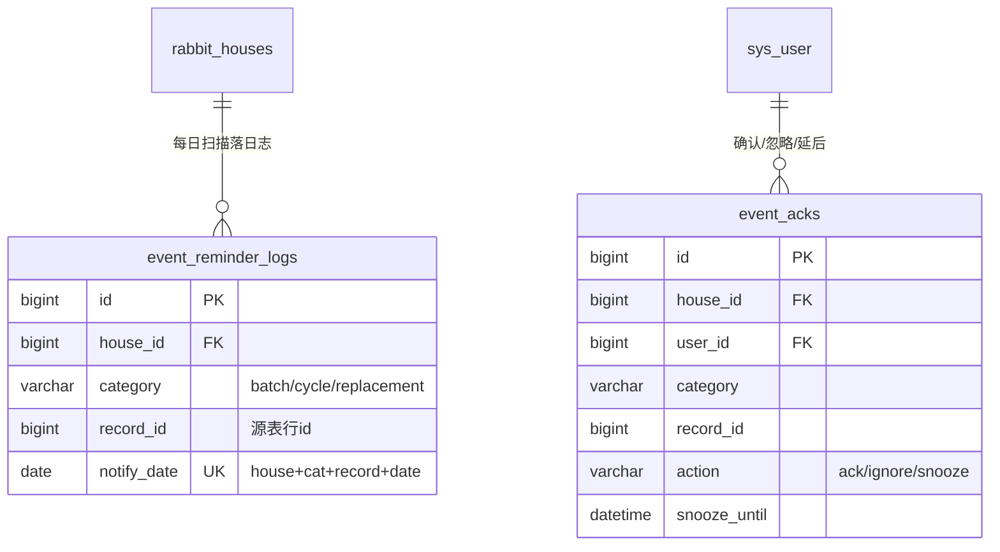
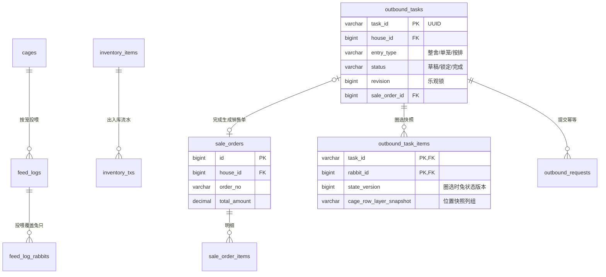
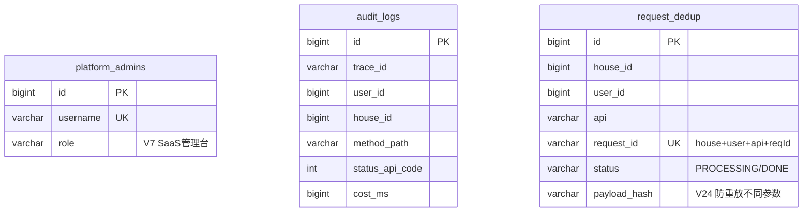

# Flyway V32 数据表结构与关联快照

状态：历史快照（截至 Flyway V32，不代表后续迁移）
来源：`backend/rabbit-boot/src/main/resources/db/migration/` V1–V32 逐一核对；实体类交叉验证
关联文档：[母兔生产流程 V2 设计](../../../features/reproduction-v2/design.md)（V2 优化设计，含本结构的问题诊断）

> 阅读约定：仅列关键字段（主键/外键/状态/守卫列），审计四列 `create_by/create_time/update_by/update_time` 与 `remark` 一律省略。`house_id` 是全局租户隔离键，除账号/平台域外所有表均携带并作为索引前缀。

---

## 0. 全景：七个域、38 张在用表

| 域 | 表 | 说明 |
| --- | --- | --- |
| 账号与租户 | `sys_user` `rabbit_houses` `house_users` `house_invitations` `phone_one_tap_attempts` `phone_one_tap_rate_buckets` | 全局账号，兔舍=租户单元 |
| 场舍基础设施 | `cages` `cage_nfc_tags` `nfc_tags` `global_setting` | 笼位、NFC、生产周期配置 |
| 兔只 | `rabbits` `rabbit_status_history` `rabbit_departure_records` `rabbit_abnormal_conditions` `replacement_records` `weight_logs` `treatment_records` | 个体全生命周期 |
| 繁育生产（核心） | `batches` `batch_rabbits` `breeding_cycles` `pregnancy_check_records` `prepartum_records` `parturition_records` `weaning_records` `weaning_record_allocations` `breeding_performance` | 生产状态机所在域 |
| 事件提醒 | `event_acks` `event_reminder_logs` `reminder_preferences` | 兼容确认记录、扫描日志、用户+兔舍级应用内提醒偏好 |
| 运营（喂养/库存/销售/出栏） | `feed_logs` `feed_log_rabbits` `inventory_items` `inventory_txs` `sale_orders` `sale_order_items` `outbound_tasks` `outbound_task_items` `outbound_requests` | 日常运营与出栏交易 |
| 平台支撑 | `platform_admins` `audit_logs` `request_dedup` | SaaS 管理台、审计、幂等 |

已废弃（迁移中建又删）：`merchants` `merchant_users` `merchant_house_policies`（V16 移除商户模型）、`sms_verification_codes`（V19 移入缓存）。

---

## 1. 账号与租户域



- **多租户方式**：单库行级隔离。请求头 `X-House-Id` → 校验 `house_users` 成员资格 → 所有 SQL 强制 `WHERE house_id=?`。
- 兔舍即租户单元；没有更上层的组织/企业实体（V2 设计中预留 `tenant_id`）。
- `phone_one_tap_*` 两表仅服务登录风控（尝试记录/限流桶），无业务外键。

## 2. 场舍基础设施域



- `global_setting` 分为用户级创建模板和兔场级独立快照。创建兔场时会把用户模板复制成 `house_id` 配置；之后修改用户模板不影响已创建兔场，状态转换和事件日期只读取当前兔场快照。存量缺失行会在首次读取时固化一次。`gestation_days` 已在 V26 配置化，不再由 `BatchService` 硬编码。

## 3. 兔只域



- `uk_rabbits_house_active_breeding_cage (house_id, active_breeding_cage_id)`：DB 层保证一笼最多一只活跃种兔/后备兔（V25，生成列模式）。
- 商品兔多只同笼，`cages.rabbit_count` 计数器维护。

## 4. 繁育生产域（核心状态机）



**状态流转链路（现状）**：

```
操作入口(BatchService) ──写──> breeding_cycles.status        (权威，8 个中文枚举)
        │                         │ syncBreedingSummary() 手工同步
        ├──写──> batch_rabbits.current_status + next_event_*  (快照)
        └──(不写)── rabbits.reproductive_stage                (录入/编辑另行维护 → 漂移)
```

四张记录表（摸胎/备产/分娩/断奶）= 各操作的明细留痕，V21 后通过 `breeding_cycle_id` 挂到周期；催情与"推迟"操作**无记录表**。

## 5. 事件提醒域（扫描式）



- **提醒无独立任务实体**，由 EventReminderScanJob（每日 00:05）扫三处源：`batch_rabbits.next_event_*`、`breeding_cycles.next_event_*`、`replacement_records.expected_mature_date`，命中即写日志并置 `is_event_notified=true`；查询时再用 `event_acks` 过滤。商品兔"可出售"按 `sale_days` 即时计算，不入此链路。

## 6. 运营域（喂养/库存/销售/出栏）



- 出栏域（V11/V23）是最新一代设计：任务制 + 快照列 + `revision`/`state_version` 双乐观锁 + 独立幂等表，规模化验证过（大场整舍出栏）。V2 繁育设计中的短事务/快照思路与此对齐。

## 7. 平台支撑域



---

## 8. 跨域关联与约束速查

| 关联 | 基数 | 实现 | 备注 |
| --- | --- | --- | --- |
| house → 一切业务表 | 1:N | `house_id` 列 + FK + 索引前缀 | 租户隔离主线 |
| rabbit → cage | N:1 | `rabbits.cage_id` | 种兔另有生成列唯一键单笼守卫 |
| rabbit ↔ batch | M:N | `batch_rabbits` | 携带状态/提醒快照（过载） |
| mother → cycle | 1:N | `breeding_cycles.mother_rabbit_id`，`uk(house,batch,mother,cycle_no)` | 同批次可多周期（与新口径冲突） |
| cycle → 4 记录表 | 1:N | `breeding_cycle_id`（V21 回填） | 催情/推迟无记录 |
| 仔兔 → 出生周期 | N:1 | `rabbits.birth_cycle_id/birth_batch_id/mother_id/father_id` | 系谱链 |
| 提醒源 | 3 处 | `batch_rabbits` / `breeding_cycles` / `replacement_records` 的 next/expected 列 | 夜间扫描汇聚 |
| 幂等 | 每写接口 | `request_id` 列唯一键 + `request_dedup` 表 | 双机制并存 |

**已知结构性痛点**（详见 V2 设计 §1）：母兔状态三写点、提醒三源扫描、`batch_rabbits` 职责过载、妊娠天数硬编码、催情/推迟操作无留痕。
