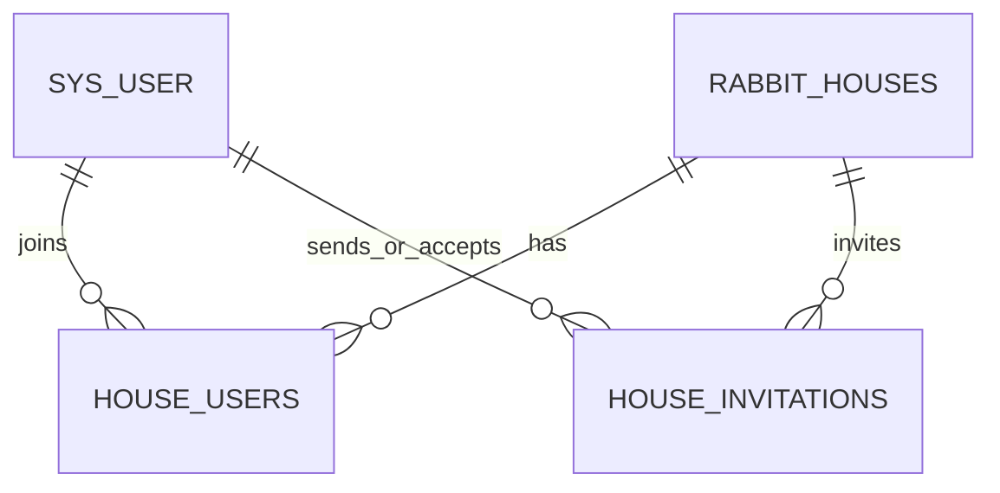

# 账号与兔场直接权限模型

## 目标

账号是全局身份，兔场是生产数据边界，`house_users` 是两者之间唯一的授权关系。账号不会因
登录而隐式拥有业务空间，也不存在可以绕过兔场成员关系的上层业务角色。



产品语义统一使用“兔场”。为控制迁移范围，数据库表 `rabbit_houses`、接口 `/api/houses`、
字段 `house_id` 和请求头 `X-House-Id` 继续沿用现有命名。

## 数据模型

### `sys_user`

`sys_user` 保存账号身份、手机号绑定、密码初始化状态和账号状态：

- `status=ENABLED`：可以登录并访问账号级接口。
- `status=DISABLED`：不能登录，已有 JWT 也不能继续访问业务接口。
- `phone_hash`：服务端 pepper 后的手机号 HMAC，具有唯一约束。
- `phone_masked`：仅用于展示。
- `password_initialized`：对外映射为 `hasPassword`。

账号可以没有任何兔场。手机号首次验证成功时只创建账号，不创建兔场。

### `rabbit_houses`

兔场状态独立于账号和成员状态：

- `ENABLED`：允许有效成员访问。
- `SUSPENDED`：平台停用，所有普通业务访问被拒绝。
- `ORPHANED`：没有有效 `OWNER` 的迁移或异常状态，只允许平台修复。
- `is_deleted=true`：已删除，不再参与普通列表和业务访问。

### `house_users`

`house_users(house_id,user_id)` 唯一，保存直接成员关系：

- `status=ENABLED`：成员关系有效。
- `status=DISABLED`：只停用该账号在该兔场的访问，不影响它加入的其他兔场。
- `role`：`OWNER`、`MANAGER`、`STAFF`、`VIEWER`。

有效访问必须同时满足：账号 `ENABLED`、兔场 `ENABLED` 且未删除、成员关系 `ENABLED`。

## 角色与权限

| 角色 | 生产能力 | 治理能力 |
| --- | --- | --- |
| `OWNER` | 全部 `control` 能力 | 管理成员、授予共同所有权、删除兔场 |
| `MANAGER` | `control` | 不管理成员或所有权 |
| `STAFF` | `edit` | 无成员治理能力 |
| `VIEWER` | `view` | 只读 |

角色生成当前兔场内的一组 `rabbit:*` 动作权限。控制器通过
`@RequiresPermission(PermissionCode...)` 声明权限，`AccessControlService` 解析账号、兔场、
成员状态和角色并写入请求上下文。业务服务保留防御性检查，Mapper/SQL 仍必须按
`house_id` 过滤。

旧客户端继续获得兼容字段：

| 角色 | `perms` | `isAdmin` |
| --- | --- | --- |
| `OWNER` | `control` | `true` |
| `MANAGER` | `control` | `false` |
| `STAFF` | `edit` | `false` |
| `VIEWER` | `view` | `false` |

新客户端以 `permissions` 决定交互入口，`role` 只用于展示角色名称。

## 共同 OWNER

所有权完全由有效的 `house_users.role=OWNER` 表示，不再维护单一所有者字段。一个兔场可以有
多位共同 `OWNER`，权限相同且都能处理成员治理。

必须保持以下不变量：

- 创建兔场时，创建者和兔场记录在同一事务中生成，创建者成为第一位有效 `OWNER`。
- 普通手机号邀请不能直接授予 `OWNER`；现有 `OWNER` 可以把已经加入的成员提升为共同 `OWNER`。
- 提升共同 `OWNER` 不会自动降级其他 `OWNER`。
- 降级、停用、移除或退出一位 `OWNER` 前，必须确认仍有至少一位其他有效 `OWNER`。
- 最后一位有效 `OWNER` 不能自行退出或被移除。只能先增加共同 `OWNER`，或由平台执行明确的恢复流程。
- 迁移发现没有有效 `OWNER` 的兔场应标记 `ORPHANED`，不能把普通成员静默提升后继续开放生产访问。

## 精确手机号邀请

成员邀请使用手机号精确匹配，不提供可枚举全平台账号的模糊搜索：

```http
POST /api/house-invitations
Authorization: Bearer <token>
X-House-Id: <houseId>
Content-Type: application/json

{
  "phone": "13800138000",
  "role": "STAFF",
  "requestId": "uuid"
}
```

规则：

- 只有具有 `rabbit:house-members:add` 的有效 `OWNER` 可以邀请。
- 手机号先标准化，再以服务端 HMAC 精确匹配；邀请表只保存 `phone_hash` 和脱敏号码。
- 邀请角色只能是 `MANAGER`、`STAFF` 或 `VIEWER`。
- 无论目标手机号是否已经绑定账号，都追加一条默认 7 天有效的 `PENDING` 邀请；提交时不直接
  创建成员关系。
- 响应始终返回 `status=SUBMITTED` 和请求角色，不泄露目标手机号是否已注册。
- 该手机号下一次通过短信验证码或运营商服务端换号完成可信登录时，自动接受仍有效的邀请并
  建立成员关系；两种认证方式复用同一接受流程。
- 同一手机号和兔场有多条有效邀请时，以最新一条角色为准，并解决此前待处理记录，旧请求
  不能覆盖更新的角色。
- 目标账号、兔场或成员状态异常时不得绕过状态检查。
- `requestId` 在兔场和邀请人范围内幂等；同一 `requestId` 不能改投其他手机号。

手机号邀请不应把完整手机号写入日志、审计详情或错误消息。

## 零兔场与创建

`GET /api/houses` 对没有成员关系的有效账号返回空数组，不返回授权错误。零兔场账号仍可访问
账号资料、设置密码、创建兔场和手机号邀请匹配所需的认证接口。

```http
POST /api/houses
Authorization: Bearer <token>
Content-Type: application/json

{
  "name": "示例兔场",
  "layoutRows": 4,
  "layoutCols": 10,
  "layoutLayers": 2,
  "remark": "",
  "requestId": "uuid"
}
```

创建请求不携带额外归属编号。后端必须在同一事务中创建兔场、初始化笼位，并写入创建者的
`OWNER` 成员关系。

## API

- `GET /api/houses`：列出当前账号直接可访问的兔场，可以为空。
- `POST /api/houses`：创建兔场并成为第一位 `OWNER`。
- `GET /api/houses/permission`：读取 `X-House-Id` 对应的角色和动作权限。
- `GET /api/house-members`：`OWNER` 查看当前兔场成员。
- `PUT /api/house-members/{userId}`：调整角色或成员状态。
- `DELETE /api/house-members/{userId}`：移除成员，不能移除最后一位有效 `OWNER`。
- `POST /api/house-members/leave`：退出当前兔场，最后一位有效 `OWNER` 不能退出。
- `POST /api/house-invitations`：按精确手机号邀请。
- `GET /api/workspaces`：列出当前账号直接可访问的业务工作空间。

兔场域接口继续使用 `X-House-Id`。路径参数与请求头同时出现时必须一致，客户端提交的
`houseId` 永远不能扩大服务端根据 `house_users` 得出的授权范围。

## 平台边界

平台管理员使用独立 JWT，不发送 `X-House-Id`。平台可以查看账号和兔场、调整状态、处理
`ORPHANED` 兔场并执行恢复操作，但默认不直接编辑生产数据。

未来如果需要容量、套餐或付费限制，应直接作用于账号或兔场，并使用独立 entitlement 或
policy 结构；不要在账号和兔场之间重新增加一个隐式授权层。

## 设备边界

MQTT、硬件指令和设备绑定不能由设备标识绕过 `house_users`。后续接入时必须从已解析并授权
的兔场上下文取得权限，再调用设备端口。
