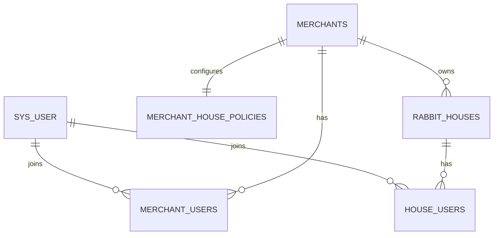

# 商户、账号与兔场权限模型

## 目标

账号是全局身份，商户是租户边界，兔场是商户下的业务空间。三者不能再通过 `sys_user.merchant_id` 合并成一个概念。

## 授权层级

| 层级 | 角色 | 能力 |
| --- | --- | --- |
| 平台 | `SUPER_ADMIN` / `ADMIN` | 管理商户、商户成员角色和商户兔场策略，不编辑生产数据 |
| 商户 | `OWNER` | 管理商户成员；监管商户下全部兔场；可按策略创建兔场 |
| 商户 | `ADMIN` | 可按策略创建兔场，只能进入已分配或自己创建的兔场 |
| 商户 | `MEMBER` | 不能创建兔场，只能进入已分配兔场 |
| 兔场 | `OWNER` | 管理兔场资料、成员、所有权和生产业务 |
| 兔场 | `MANAGER` | 具有 `control` 生产权限，不管理成员或转让所有权 |
| 兔场 | `STAFF` | 具有 `edit` 生产权限 |
| 兔场 | `VIEWER` | 只读 |

商户成员必须为 `ENABLED`，商户本身也必须为 `ENABLED`。任一层被停用后，即使 `house_users` 仍有记录，也不能访问对应兔场。

角色只负责生成该作用域内的一组动作权限，接口不直接判断角色字符串：

| 作用域 | 权限码示例 | 授权来源 |
| --- | --- | --- |
| 平台 | `platform:merchants:list`、`platform:accounts:list` | 平台管理员角色 |
| 商户 | `merchant:houses:add`、`merchant:members:edit` | `merchant_users` 角色和状态 |
| 兔场 | `rabbit:rabbits:add`、`rabbit:houses:edit`、`rabbit:house-members:list` | 商户边界与 `house_users` 角色 |

控制器统一用 `@RequiresPermission(PermissionCode...)` 声明权限；`AccessControlService`
集中解析登录身份、商户、兔场和角色，成功后写入本次请求的兔场上下文。业务服务保留必要的
防御性校验，Mapper/SQL 仍必须按 `house_id` 过滤，不能仅依赖前端隐藏按钮。

## 商户兔场策略

平台 Admin 为每个商户维护一条 `merchant_house_policies`：

- `house_creation_enabled`：是否允许创建兔场。
- `house_member_management_enabled`：兔场 owner 是否可维护成员。
- `max_house_count`：有效兔场数量上限。
- `max_members_per_house`：单兔场成员数量上限。

策略只控制兔场治理能力，不授予生产数据权限。平台 Admin 仍然只能查看商户生产概览。

## 兼容规则

`sys_user.merchant_id` 暂时保留，语义调整为账号的默认商户，用于旧 App 未传 `merchantId` 时的兼容解析。所有新授权判断统一使用 `merchant_users`，不得用默认商户字段判断用户是否属于某商户。

兔场成员继续返回旧的 `perms` 和 `isAdmin`：

| 新角色 | 兼容 `perms` | 兼容 `isAdmin` |
| --- | --- | --- |
| `OWNER` | `control` | `true` |
| `MANAGER` | `control` | `false` |
| `STAFF` | `edit` | `false` |
| `VIEWER` | `view` | `false` |

新 App 应优先读取 `permissions`；`role` 用于角色展示，`perms` 和 `isAdmin` 只用于兼容。
创建兔场时必须显式提交 `merchantId`。

## API

业务账号：

- `GET /api/merchant-memberships`：列出当前账号加入的商户。
- `GET /api/merchant-memberships/{merchantId}/members`：商户 owner 查看成员。
- `POST /api/merchant-memberships/{merchantId}/members`：商户 owner 绑定已有账号。
- `PUT /api/merchant-memberships/{merchantId}/members/{userId}`：调整角色、状态或转让所有权。
- `DELETE /api/merchant-memberships/{merchantId}/members/{userId}`：移除非 owner 成员。
- `POST /api/houses`：可选传 `merchantId`；多商户客户端必须显式传入。

平台 Admin：

- `GET /api/admin/merchants/{merchantId}/house-policy`
- `PUT /api/admin/merchants/{merchantId}/house-policy`
- `PUT /api/admin/merchants/{merchantId}/accounts/{userId}/membership`

## 设备边界

MQTT、硬件指令和设备绑定不参与本阶段授权重构，继续保持 pending。后续接入时必须从已解析的商户和兔场上下文取得授权，不能由设备标识绕过 `merchant_users` 与 `house_users`。
