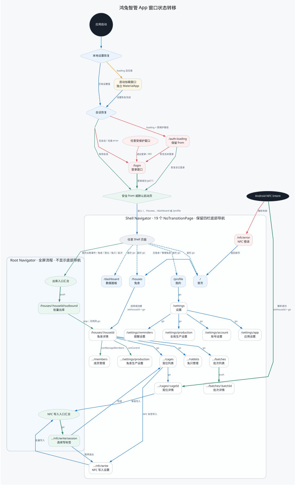
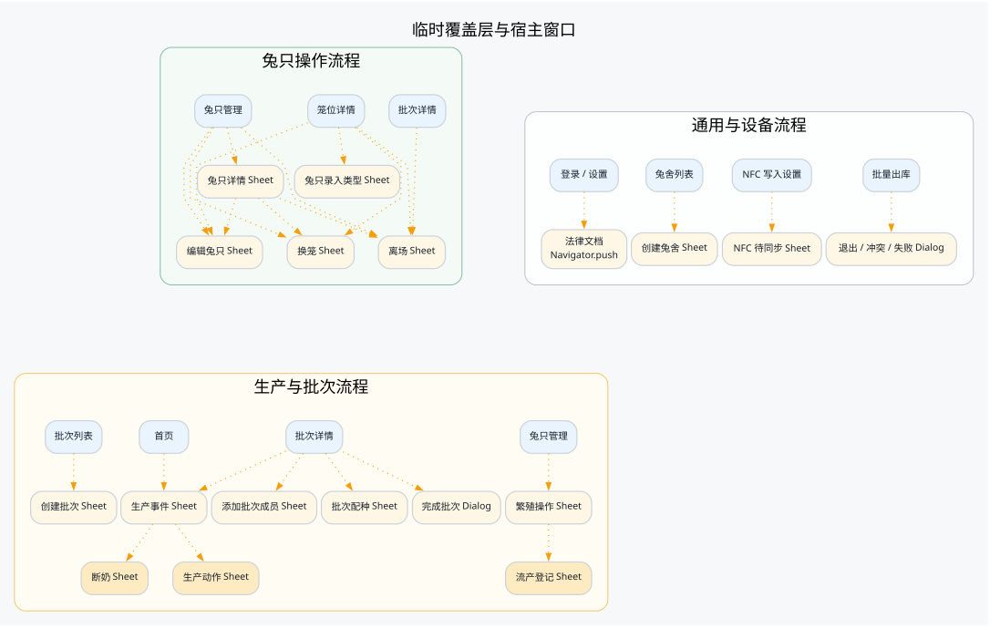
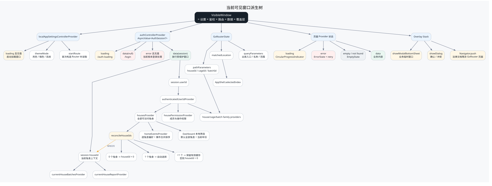

# App 窗口状态转移

本文按当前 Flutter 源码还原可见窗口、路由跳转和 Riverpod 派生关系。这里的“窗口”包括
GoRouter 页面、根级全屏流程和临时 Sheet/Dialog；普通页面内部的筛选、分页和表单字段不单独
作为窗口节点。

## 可编辑排布板

需要重排窗口、讨论信息架构或复用弹层组件时，直接在 Excalidraw 中打开
[`../design/app-interface-layout-board.excalidraw`](../design/app-interface-layout-board.excalidraw)。每个手机窗口和
Sheet/Dialog 素材均已分组，路由箭头绑定到窗口外框，可以整组拖动后继续编辑。

需要集中检查画面层级和跨页面联系时，使用
[`../design/app-navigation-tree.excalidraw`](../design/app-navigation-tree.excalidraw)。它将 Navigator 页面树、
鉴权/NFC/出库核心流程和临时覆盖层分成三个独立区域，避免跨树连线干扰主结构。

需要完整追踪“当前画面如何被状态派生”时，首选
[`../design/app-complete-state-machine.excalidraw`](../design/app-complete-state-machine.excalidraw)。该图以
`VisibleWindow` 为根，完整展开设置门、鉴权、Router、Provider 上下文、页面异步态、路由清单、
Outbound 三轴状态以及 NFC 九阶段状态机。

## 主窗口状态转移



图中四类边的语义：

- 蓝色实线：`go`，替换当前路由位置。
- 绿色实线：`push`，压入导航栈，流程结束后可以 `pop` 回到来源。
- 黄色点线：Sheet、Dialog 或普通 `Navigator.push` 临时覆盖层。
- 红色虚线：鉴权重定向、会话失效或错误分支。

## 临时覆盖层



这些 Sheet、Dialog 和普通 `Navigator.push` 页面不进入 GoRouter URL，关闭后返回宿主窗口。
其中兔只详情和生产事件 Sheet 还会继续派生第二层业务窗口。

## 状态派生树



最终可见窗口可概括为：

```text
VisibleWindow = LocalSettings × AuthState × RouterLocation × PageData × OverlayStack
```

## 结构结论

1. 路由表包含 23 个 `GoRoute`：4 个根级路由和 19 个 `ShellRoute` 子页面。
2. 带 `/houses/:houseId/...` 前缀的页面在路由表中是 Shell 下的同级节点，不是真正嵌套的父子路由。
3. 大多数详情跳转和返回使用 `go`；底栏也使用 `go`，因此不保留每个 Tab 的独立历史栈。
4. 批量出库和连续写 NFC 位于根 Navigator，不显示底部导航。
5. `currentHouseId` 是会话上下文，不是路由守卫；页面路径参数和当前兔舍状态可以短暂不同步。
6. 权限只控制入口和页面内容，GoRouter 的全局 `redirect` 只校验登录态。
7. 首页事件默认汇总全部可访问兔舍；数据面板默认也是全部兔舍，而非 `currentHouseId`。

## 关键源码

- 启动、设置门和 NFC Intent：`app/lib/src/app.dart`
- 路由、Navigator 分层和鉴权重定向：`app/lib/src/routing/router.dart`
- 会话与当前兔舍派生：`app/lib/src/ui/auth/view_models/auth_controller.dart`
- 底部导航映射：`app/lib/src/ui/core/widgets/app_shell.dart`
- 出库内部状态机：`app/lib/src/ui/outbound/view_models/outbound_controller.dart`
- NFC 写入内部状态机：`app/lib/src/ui/nfc/view_models/nfc_write_controller.dart`

## 重新渲染

修改同目录 `.dot` 文件后运行：

```bash
dot -Tsvg docs/flutter_app/modules/window-state-transitions.dot \
  -o docs/flutter_app/modules/window-state-transitions.svg
dot -Tsvg docs/flutter_app/modules/window-state-overlays.dot \
  -o docs/flutter_app/modules/window-state-overlays.svg
dot -Tsvg docs/flutter_app/modules/window-state-derivation.dot \
  -o docs/flutter_app/modules/window-state-derivation.svg
```
